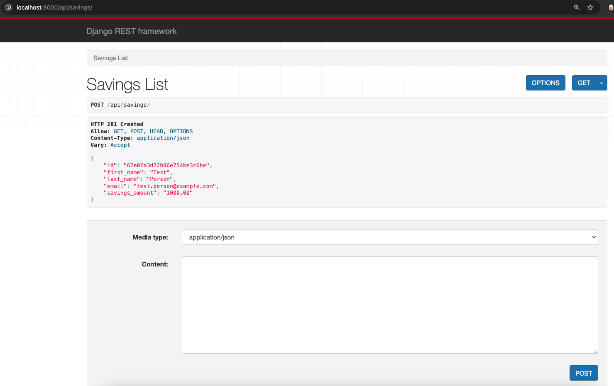
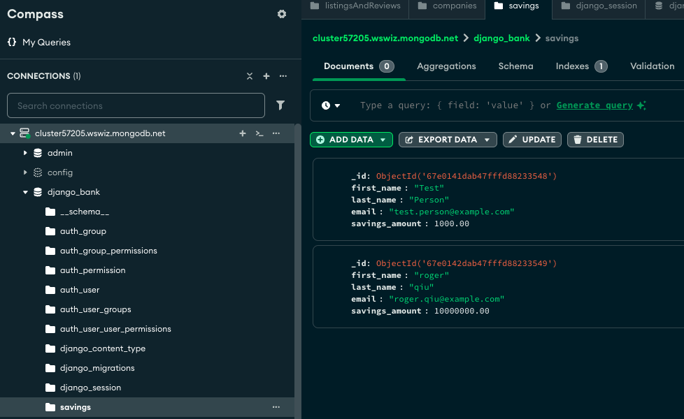

# Django Bank

- Simple Django application using MongoDB (via Djongo), with RESTful APIs to create, read, update, and delete account information.

- Unlike relational databases, MongoDB doesn't enforce a rigid schema. So you can can add, remove, or modify fields in your model without needing to run migrations or alter the database structure. Each document (record) in a collection (table) can have a different structure.

- Djongo is a database connector that allows Django to work with MongoDB. It serves as a bridge between Django's ORM (Object-Relational Mapper) and MongoDB's document-oriented structure.

## Technologies Used

- Django
- Django REST Framework
- MongoDB (hosted on Atlas)
- Python 3.11+
- Djongo ORM

## Project Structure

```
django_bank/
├── manage.py
├── django_bank/
│   ├── settings.py
│   ├── urls.py
│   └── wsgi.py
├── savings/
│   ├── models.py
│   ├── views.py
│   ├── urls.py
│   ├── serializers.py
└── README.md
```

## Running the Application

1. Download and unzip the project
2. Navigate to the project directory
3. Create a virtual environment and activate it:
   ```
   python -m venv venv
   source venv/bin/activate  # On Windows use venv\Scripts\activate
   ```
4. Install dependencies:
   ```
   pip install django djangorestframework mongoengine pymongo dnspython
   ```
5. Run the server:
   ```
   python manage.py runserver
   ```
6. The application will start on port 8000: http://localhost:8000/api/savings

## API Endpoints

- `GET /api/savings` — Get all accounts
- `GET /api/savings/<id>` — Get account by ID
- `POST /api/savings` — Create a new account
- `PUT /api/savings/<id>` — Update an account
- `DELETE /api/savings/<id>` — Delete an account

## Example curl Commands

### Create a new account

Paste the following into Postman GUI:
```bash
{"first_name":"Test","last_name":"Person","email":"test.person@example.com","savings_amount":1000.00}
```
or using curl:
```bash
curl -X POST http://localhost:8000/api/savings/   -H "Content-Type: application/json"   -d '{"first_name":"Test","last_name":"Person","email":"test.person@example.com","savings_amount":1000.00}'
```

### Get all accounts
Click on the GET button in Postman or:
```bash
curl -X GET http://localhost:8000/api/savings/
```

### Get account by ID
```bash
curl -X GET http://localhost:8000/api/savings/<id>/
```

### Update account
```bash
curl -X PUT http://localhost:8000/api/savings/<id>/   -H "Content-Type: application/json"   -d '{"first_name":"John","last_name":"Doe","email":"john.doe@example.com","savings_amount":2000.00}'
```

### Delete account
```bash
curl -X DELETE http://localhost:8000/api/savings/<id>/
```

## How Data Flows Through the Application


```
Client (Browser / Curl / Frontend)
            │
            ▼
────────────────────────────────────
🌐 Controller Layer (views.py)
- Handles routing logic (GET, POST, PUT, DELETE)
- Extracts data from request (e.g., path variables, body)
- Calls the serializer to validate input or serialize output
- Calls the model layer to query or modify MongoDB
- Returns a JSON `Response` to the client
────────────────────────────────────
            │
            ▼
🧠 Serializer Layer (serializers.py)
- Acts as a **bridge** between Python objects (models) and JSON
- Validates incoming data for required fields, types, etc.
  → e.g., "is this a valid email?", "is savings_amount a decimal?"
- Converts incoming JSON to Python model instances (for POST/PUT)
- Converts model instances back to JSON (for GET responses)
────────────────────────────────────
            │
            ▼
📦 Model Layer (models.py)
- Your `Savings` model represents MongoDB documents
- You define the schema: fields like `_id`, `first_name`, etc.
- Powered by **djongo**, it maps the model to MongoDB collections
- CRUD operations like `.save()`, `.objects.get(...)`, `.delete()` trigger queries to MongoDB
────────────────────────────────────
            │
            ▼
🗃️ MongoDB (Atlas Cloud)
- Stores actual savings account data in the `savings` collection
- Hosted in the `django_bank` database on MongoDB Atlas
- Responds to read/write queries from Django
- `_id` fields are stored as `ObjectId` types (not strings)
────────────────────────────────────
            ▲
            │
⬅️ Django builds a JSON Response and sends it back to the Client
```


1. Client sends HTTP request (e.g., GET /api/savings)
2. Django view handles the request
3. View queries MongoDB via Djongo
4. Result is passed through serializer for JSON conversion
5. JSON response is sent back to client

## Django Architecture Highlights

### manage.py
- Django’s CLI utility to run the server, make migrations, etc. in the terminal.

### settings.py
- Contains settings for app configuration, database connection, and installed apps.
- Uses Djongo to connect to MongoDB Atlas.

### urls.py
- Routes URL patterns to Django views.

### models.py
- Defines `Savings` document class to represent MongoDB documents.

### serializers.py
- Validates and transforms incoming/outgoing data.
- Handles converting MongoEngine documents to JSON and back.

### views.py
- Contains RESTful endpoints using `APIView` classes.
- Handles GET, POST, PUT, DELETE operations for Savings accounts.

### MongoDB (Atlas)
- Cloud-hosted document database storing the app data.
- Connected via `mongoengine.connect()` in `settings.py`.